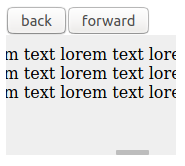

# Scrolling Buttons

Very simple example using buttons to simulate scrolling HTML elements.

<p align='center'></p>

## Usage

Copy de ScrollingButtons.js file and put in your project. Customize and call that component.

```JAVASCRIPT

import Scroll from './ScrollingButtons';

ReactDOM.render(
  <Scroll />,
  document.getElementById('root')
);
```
